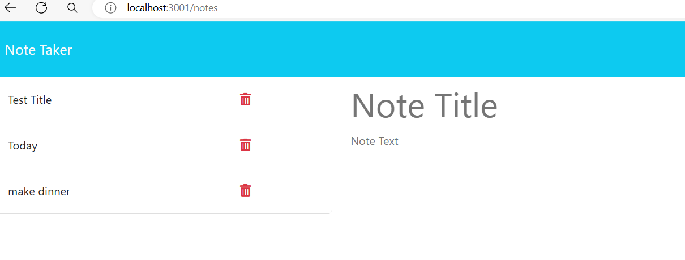

# Copy-list

## Description
Copy-List is a Note Taker application that can be used to write and save notes. This application will use an Express.js back end and will save and retrieve note data from a JSON file.

### Installation
This project uses express, inquirer, and uuid. To install, the user must enter the following commands into the command line interface: npm i, npm install uuid. npm i installs express and npm install uuid enables file for the uuid dependency.

### How to use Copy-List
In the CLI the user will run NPM START. At the bottom on the terminal the user must control click on the http link listening on the port. This will take you to the browser with a get started button. Once clicked, the user can enter notes with a title and text. The notes entered will populate the left side of the page. The user can also check what they entered in the back-end json file by navigating to the db folder and clicking db.json file. 

#### Deployed Application 
[application](https://kydrian.github.io/Copy-list/)

###### Contributions
-Kydrian Green

Thanks to my instructors and TA at the UNCC Bootcamp for providing me with a starter code. Thanks for my wonderful colleagues for additional help completing this project.